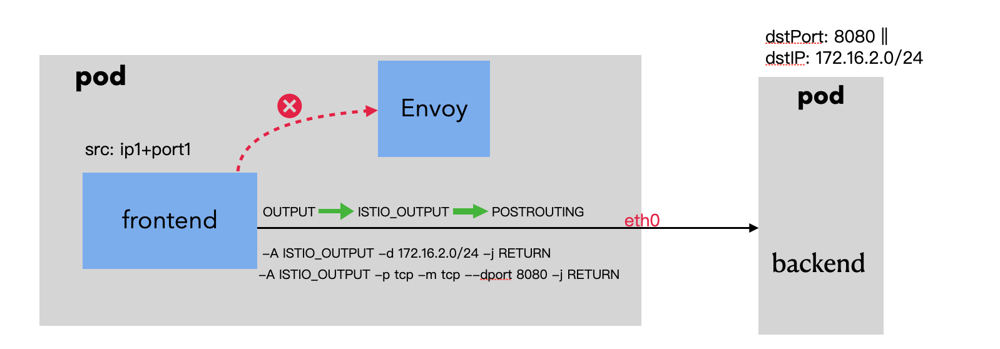

### 一: 关于sidecar的自动注入


我们都知道集群中安装了istio后，只需要给 namespace 打上`istio-injection=enabled` 这个标签，之后这个namespace下的所有pod都会注入边车容器istio-proxy，这也分两种情况，存量pod需要重启才能生效，新下发的pod会直接注入sidecar容器。


---

### 二: 带着疑问看待sidecar容器

当pod 注入边车容器istio-proxy时，pod会发生什么

1. sidecar 是如何自动注入的？
2. 我们都知道istio-proxy可以拦截流量，具体是如何拦截流量的。
3. 注入了sidecar之后，pod会有哪些变化
4. 注入了sidecar之后，不想拦截特定流量如何处理

---

### 三: sidcar容器如何注入

 


1. 在创建Pod的请求到达Kube-apiserver后，首先进行认证鉴权，然后在准入控制阶段 kube-apiserver以REST的方式同步调用sidecar-injector webhook服务进行init容器与istio-proxy容器的注入，最后将Pod对象持久化存储到Etcd中.

   ```yaml
   apiVersion: admissionregistration.k8s.io/v1
   kind: MutatingWebhookConfiguration
   metadata:
     name: istio-revision-tag-default
   webhooks:
   ......
   - admissionReviewVersions:
     - v1beta1
     - v1
     clientConfig:
       caBundle:  xxx
       service:
         name: istiod
         namespace: istio-system
         path: /inject
         port: 443
     failurePolicy: Fail
     matchPolicy: Equivalent
     name: namespace.sidecar-injector.istio.io
     namespaceSelector:
       matchExpressions:
       - key: istio-injection
         operator: In
         values:
         - enabled
     rules:
     - apiGroups:
       - ""
       apiVersions:
       - v1
       operations:
       - CREATE
       resources:
       - pods
       scope: '*'
     ... ...
   ```

   由上述配置可知，webhook服务由istiod提供，在istio 1.5 版本之后sidecar-injector 被编译到istiod进程中。sidecar-injector 对标签匹配 `istio-injection : enabled` 的命名空间的Pod资源对象的创建生效。


2. 我们看到pod注入sidecar后，pod的容器配置会发生变化，这种配置有没有对应的模板参数呢？

   istio-proxy 容器的配置如下:

   ```yaml
   containers:
       - name: istio-proxy
         image: docker.io/istio/proxyv2:1.19.0
         args:
           - proxy
           - sidecar
           - '--domain'
           - $(POD_NAMESPACE).svc.cluster.local
           - '--proxyLogLevel=warning'
           - '--proxyComponentLogLevel=misc:error'
           - '--log_output_level=default:info'
         ports:
           - name: http-envoy-prom
             containerPort: 15090
             protocol: TCP
         env:
           ......
         volumeMounts:               # istio-proxy 容器挂载的证书及配置文件
           - name: workload-socket
             mountPath: /var/run/secrets/workload-spiffe-uds
           - name: credential-socket
             mountPath: /var/run/secrets/credential-uds
           - name: workload-certs
             mountPath: /var/run/secrets/workload-spiffe-credentials
           - name: istiod-ca-cert
             mountPath: /var/run/secrets/istio
           - name: istio-data
             mountPath: /var/lib/istio/data
           - name: istio-envoy					#Envoy的启动配置文件 envoy-rev0.json
             mountPath: /etc/istio/proxy     
           - name: istio-token					# Envoy 访问istiod用的token
             mountPath: /var/run/secrets/tokens 
           - name: istio-podinfo			 	# 以文件形式保存 Pod自身服务的信息，包含annotations和labels文件，这两个文件将被pilot-agent读取
             mountPath: /etc/istio/pod      
           - name: kube-api-access-xsnpl
             readOnly: true
             mountPath: /var/run/secrets/kubernetes.io/serviceaccount
         securityContext:
           ......
           runAsUser: 1337  # Sidecar运行用户 
           runAsGroup: 1337
   ```

   其中volumeMounts 用来将Envoy启动时用到的静态配置文件envoy-rev0.json,Pod身份信息，证书等，以文件形式挂载到Envoy进程可以访问的文件目录下。

   

   istio-init 容器的配置:

   ```yaml
     initContainers:  
       - name: istio-init
         image: docker.io/istio/proxyv2:1.19.0
         args:
           - istio-iptables
           - '-p'
           - '15001'
           - '-z'
           - '15006'
           - '-u'
           - '1337'
           - '-m'
           - REDIRECT
           - '-i'
           - '*'
           - '-x'
           - ''
           - '-b'
           - '*'
           - '-d'
           - 15090,15021,15020
           - '--log_output_level=default:info'
         securityContext:
           capabilities:
             add:
               - NET_ADMIN
               - NET_RAW
             drop:
               - ALL
           ......
   ```

   istio-init 容器，用于初始化pod网络，负责对Pod配置定制的iptables规则，所以也需要被赋予NET_ADMIN权限。

   对于istio-proxy和istio-init容器配置其实都是有模板的。原始注入模板及默认值通过名为`istio-sidecar-injector`的ConfigMap 资源保存在istio-system 命名空间下。

   

---

### 四: Sidecar拦截流量

 

在完成Sidecar自动注入后，业务在Pod运行期间收发的网络流量将被透明的拦截进Sidecar。其流量拦截基于iptables规则，拦截应用容器的Inbound流量或Outbound流量。

主要分为两大部分:

- istio-init容器用于设置pod中的iptables转发规则

- Sidecar容器 istio-proxy拦截流量

  

1. istio-init容器

   istio容器会在完成iptables规则配置操作后退出，该容器的启动命令: `istio-iptables -p 15001 -z 15006 -u 1337 -m REDIRECT -i '*' -x "" -b '*' -d 15090,15021,15020`

   `-z 15006` 表示将进入应用容器的所有流量都转发到sidecar的15006端口

   `-u  1337`  指定不应用重定向的uid，默认是1337，即使用istio-proxy用户身份运行

   `-m REDIRECT`  表示使用REDIRECT模式重定向流量

   `-p 15001`  将所有出战流量都重定向到sidecar的15001端口

   `-d 15090,15021,15020` 表示排除该三个端口，所有的入流量都会被重定向处理。15020和15090都是遥测暴露指标的端口，15021监控检查的端口

   `-i "*"`  表示重定向所有的出站流量

   `-x ""`  表示排除指定的网端ip地址，对出站流量不进行重定向处理。 为空 没有需要排除的ip

   `-b "*"` 表示重定向所有入站流量到Envoy

   结合上述解释该命令表示: 让sidecar代理可以拦截所有进出Pod的流量，除了15090，15021,15020端口的所有入站流量都被重定向到15006端口(sidecar),还可以拦截应用容器的出战流量，这些流量经过sidcar(通过15001端口监听)处理后才能出站。	

2. Sidecar拦截流量规则解析

   这里我们分析默认的Redirect模式下的流量如何拦截。sidecar与用户进程共享同一个网络命名空间，工作在相同的网络协议栈上。sidecar 对协议栈iptables规则的配置，将影响用户应用程序报文的流向，可以透明的拦截用户报文，并进行七层处理。

   以我测试环境的pod为例:

   使用iptables 命令查看当前配置的iptables规则：(如果登录pod，没有iptables命令的话，也可以使用Pod内的Envoy进程的Pid，通过nsenter命令进入istio-proxy容器的网络空间)

   列出NAT(网络地址转换)表的所有规则(因为是redirect模式，只需要查看nat表，Nat表主要用来修改报文的IP地址，端口等信息)

   ```bash
   nettool-69f5bd7486-l9wx2~$ iptables -t nat -S
   -P PREROUTING ACCEPT
   -P INPUT ACCEPT
   -P OUTPUT ACCEPT
   -P POSTROUTING ACCEPT
   -N ISTIO_INBOUND
   -N ISTIO_IN_REDIRECT
   -N ISTIO_OUTPUT
   -N ISTIO_REDIRECT
   -A PREROUTING -p tcp -j ISTIO_INBOUND
   -A OUTPUT -p tcp -j ISTIO_OUTPUT
   -A ISTIO_INBOUND -p tcp -m tcp --dport 15008 -j RETURN
   -A ISTIO_INBOUND -p tcp -m tcp --dport 15090 -j RETURN
   -A ISTIO_INBOUND -p tcp -m tcp --dport 15021 -j RETURN
   -A ISTIO_INBOUND -p tcp -m tcp --dport 15020 -j RETURN
   -A ISTIO_INBOUND -p tcp -j ISTIO_IN_REDIRECT
   -A ISTIO_IN_REDIRECT -p tcp -j REDIRECT --to-ports 15006
   -A ISTIO_OUTPUT -s 127.0.0.6/32 -o lo -j RETURN
   -A ISTIO_OUTPUT ! -d 127.0.0.1/32 -o lo -p tcp -m tcp ! --dport 15008 -m owner --uid-owner 1337 -j ISTIO_IN_REDIRECT
   -A ISTIO_OUTPUT -o lo -m owner ! --uid-owner 1337 -j RETURN
   -A ISTIO_OUTPUT -m owner --uid-owner 1337 -j RETURN
   -A ISTIO_OUTPUT ! -d 127.0.0.1/32 -o lo -p tcp -m tcp ! --dport 15008 -m owner --gid-owner 1337 -j ISTIO_IN_REDIRECT
   -A ISTIO_OUTPUT -o lo -m owner ! --gid-owner 1337 -j RETURN
   -A ISTIO_OUTPUT -m owner --gid-owner 1337 -j RETURN
   -A ISTIO_OUTPUT -d 127.0.0.1/32 -j RETURN
   -A ISTIO_OUTPUT -j ISTIO_REDIRECT
   -A ISTIO_REDIRECT -p tcp -j REDIRECT --to-ports 15001
   ```
   
   `-P PREROUTING ACCEPT ` : 接受进入PREROUTING链的报文，其他链同理

   `-N ISTIO_INBOUND` : 声明一个自定义的链 ISTIO_INBOUND

   `-A PREROUTING -p tcp -j ISTIO_INBOUND` : 将进入PREROUTING链的TCP流量跳转到ISTIO_INBOUND链 做进一步处理

   `-A ISTIO_INBOUND -p tcp -m tcp --dport 15008 -j RETURN`  : 对进入ISTIO_INBOUND链的目标端口为15008的TCP流量不做特殊处理，直接让其通过

   `-A ISTIO_IN_REDIRECT -p tcp -j REDIRECT --to-ports 15006` : 对进入ISTIO_IN_REDIRECT链的TCP流量进行报文修改,REDIRECT 对应DNAT修改方式，修改目标端口为15006

   `-A ISTIO_OUTPUT -s 127.0.0.6/32 -o lo -j RETURN`:  对进入ISTIO_OUTPUT链的源地址为127.0.0.6的报文且目标网络设备为lo本地设备的流量，不进行特殊处理

   `-A ISTIO_OUTPUT ! -d 127.0.0.1/32 -o lo -p tcp -m tcp ! --dport 15008 -m owner --uid-owner 1337 -j ISTIO_IN_REDIRECT`: 

   对进入ISTIO_OUTPUT链且目标地址虽然不然127.0.0.1,但判断目标网络设备为本地，即pod自身地址的报文，若报文发送进程为uid=1337，则Envoy转到ISTIO_IN_REDIRECT链继续处理


3. 分析Outbound场景下流量走向

     

   上图模拟了两个服务之间的通信，主要是描述东西向流量客户端访问服务端其中outbound流量的过程。(istio中很多流量治理的功能都是在outbound过程生效)

   1️⃣: 客户端通过service访问服务端(svcName:port)。  四元组信息: `srcIP: ip1 srcPort: port1 ==> dst:backend ,dscPort:port2`

   ​    服务端域名经过DNS解析后，得到clusterIP，然后封装发送SYN报文，随后报文被pod内的iptables规则拦截

   ​    首先命中该规则: `-A OUTPUT -p tcp -j ISTIO_OUTPUT`，将进入output链的tcp流量转发到istio_output链做进一步处理

   ​    随后命中该规则: `-A ISTIO_OUTPUT -j ISTIO_REDIRECT` , 将所有出站流量(非本地的)转发给istio_redirect链来处理

   ​    最后命中该规则: `-A ISTIO_REDIRECT -p tcp -j REDIRECT --to-ports 15001` ,对进入ISTIO_REDIRECT链的TCP流量进行报文修改，目标端口重定向到15001

   2️⃣: Envoy接受到报文，开始针对流量进行治理。在Envoy中会根据配下发的配置还原目标服务的ClusterIp和port。

   ​    随后根据Envoy内配置的负载均衡策略选择一个后端实例IP作为目的IP，并创建连接。

   3️⃣: Envoy准备发送报文。istio-proxy的运行用户和用户组均为1337。四元组信息: ` srcIP:ip1, srcPort:随机端口(port3) ==> dstIP:ip2,dstPort:port2 `

   ​    命中规则: `-A ISTIO_OUTPUT -m owner --uid-owner 1337 -j RETURN` ,对进入istio_output链，报文发送用户为1337的流量 放行通过。

   4️⃣: Envoy接受流量。此时目标服务backend已接受到报文，开始回包给客户端envoy。四元组信息: `scrIP:ip2, srcPort:port2 ==> dstIP:ip1,dstPort:port3`

   5️⃣: Envoy发送流量。此时envoy会将报文转发给业务容器。四元组信息: `scrIP: 127.0.0.1, srcPort:15001 ==> dstIP:ip1,dstPort:port1`

   

   

4. 分析Inbound场景下的流量走向

    

   
   
   Inbound流量指从Pod外进入Pod内的流量。比如客户端访问服务端，应用数据报文在进入服务端时就会被拦截，从而进入envoy 15006监听端口来处理，同时例如15008 mtls隧道端口,15090,15020遥测监控端口，15021健康检查端口，均不会被拦截。
   
   1️⃣: 此时服务端POD接受流量，流量首先会经过prerouting链处理。
   
   ​    然后命中iptables规则: `-A PREROUTING -p tcp -j ISTIO_INBOUND` ,将进入PREROUTING链的TCP流量跳转到ISTIO_INBOUND链 做进一步处理.
   
   ​    接着命中iptables规则: `-A ISTIO_INBOUND -p tcp -j ISTIO_IN_REDIRECT`,如果目标端口不是15008，15090，15020，15021，则将流量跳转到ISTIO_IN_REDIRECT链进行处理。
   
   ​    最后命中iptables规则: `-A ISTIO_IN_REDIRECT -p tcp -j REDIRECT --to-ports 15006`，报文被拦截并通过DNAT方式修改目标地址，将访问端口置为15006。
   
   2️⃣: 此时流量被拦截至Envoy容器进行处理，Envoy容器将流量发送给业务容器进行处理。
   
   ​    命中规则: `-A ISTIO_OUTPUT -m owner --uid-owner 1337 -j RETURN` ,表示Envoy发送给Pod后端backend容器的流量不再被拦截。
   
   3️⃣: 业务容器接受到报文后，会进行回包。
   
   4️⃣: 存在一些PassthroughCluster场景,例如直接访问podIP，此时Inbound请求根据目标地址没有找到后端服务时，下游请求将被转发到Envoy内置的PassthroughCluster服务中，最后按照原始目标地址转发下游请求
   
   5️⃣: Envoy发送报文，命中iptables规则: `-A ISTIO_OUTPUT -s 127.0.0.6/32 -o lo -j RETURN`。处理Passthroughcluster流量时，源ip会被置为127.0.0.6。此时在output链处理阶段，被转发的请求会被放行。同时因为目标网络涉别为lo，可以访问到本pod内未注册的后端服务。


---

### 五: 如何定制化拦截流量

在实际的使用过程中，如果业务容器访问某些应用不希望流量被拦截，该怎么才能做到呢？

istio中根据流量拦截的原理是iptables规则的配置。我们可以给应用加上对应的规则即可，例如出站流量对端口8080不做拦截，出站流量对172.16.2.0/24目标网段不做拦截。

 

就需要配置以下规则:  因为所有的出站包都会转发到ISTIO_OUTPUT链上，所以基于该链配置放行规则

`-A ISTIO_OUTPUT -p tcp -m tcp --dport 8080 -j RETURN` `-A ISTIO_OUTPUT -d 172.16.2.0/24 -j RETURN`

这些规则，如何下发下去呢？其实istio提供了基于podAnnotation配置的方式控制拦截行为: https://istio.io/latest/docs/reference/config/annotations/

测试一下:

在对应的工作负载添加配置:

`traffic.sidecar.istio.io/excludeOutboundPorts` : 出站流量放行的端口

`traffic.sidecar.istio.io/excludeOutboundIPRanges` : 出站流量放行的ip地址


登录pod中查看iptables规则: `iptables -t nat -L -nv` ,可以发现在ISTIO_OUTPUT 新增了两条放行规则

 


---

### 六: 总结

本篇文章着重介绍了sidecar的注入机制，以及sidecar容器istio-proxy的工作原理。相信看到这里，大家已经对istio-proxy如何拦截流量有了初步的认识。接下来我们继续学习istio-proxy是如何治理流量的，