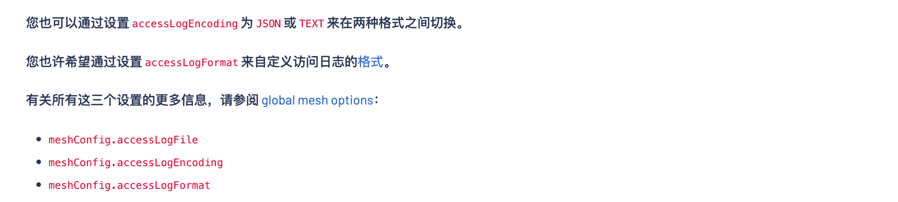
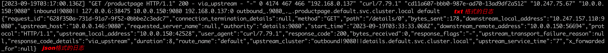

### 

1. istio 日志格式调整/日志级别调整

修改istio-system ns下的 configmap，名称为istio

`accessLogEncoding: JSON`  ,默认是txt



调整后效果如下

 

istio proxy 的日志级别包括trace, debug, info, warning, error, critical, off

调整方式有两种，一种是全局级别，一种是负载级别

a. 全局调整如下:

`kubectl edit cm istio-sidecar-injector -n istio-system `

 

b. 负载级别调整

在deployment中的podTemplate中添加

```yaml
  template:
    metadata:
      annotations:
        "sidecar.istio.io/logLevel": debug # 可选: trace, debug, info, warning, error, critical, off
```

c. 临时调整

```bash
kubectl exec -n [namespace]  [podname] -c istio-proxy -- curl -XPOST -s -o /dev/null http://localhost:15000/logging?level=debug
```

d. istioctl 调整

```yaml
istioctl -n [namespace] proxy-config log [podname] --level debug
```


### 二: istio日志链路跟踪


### 三: istio 请求体压缩


### 四：istio 调用链采样率设置

istio 从1.0.3开始。default的采样率已经降低到1% ，这意味着istio捕获的100个追踪实例中只有1个将报告给追踪后端。demo文件中设置的采样率仍为100%。

https://istio.io/latest/zh/docs/tasks/observability/distributed-tracing/mesh-and-proxy-config/

```yaml
apiVersion: apps/v1
kind: Deployment
metadata:
  name: sleep
spec:
  ...
  template:
    metadata:
      ...
      annotations:
        ...
        proxy.istio.io/config: |
          tracing:
            sampling: 10
            custom_tags:
              my_tag_header:
                header:
                  name: host
    spec:
      ...
```

```yaml
apiVersion: install.istio.io/v1alpha1
kind: IstioOperator
spec:
  meshConfig:
    enableTracing: true
    defaultConfig:
      tracing:
        sampling: 50

```


---

可以让特定范围的IP绕过envoy sidecar代理直接访问外部服，可以通过修改`global.proxy.includeIPRanges`和`global.proxy.excludeIPRanges`，

并使用`kubectl apply`命令更新`istio-sidecar-injector`配置实现。

也可以通过annotation在pod上进行设置，例如`traffic.sidecar.istio.io/includeOutboundIPRanges`

