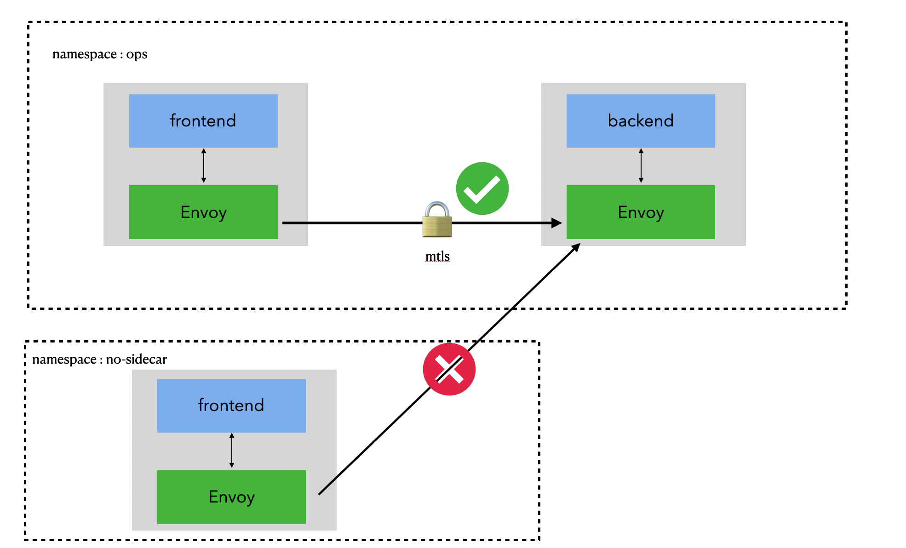
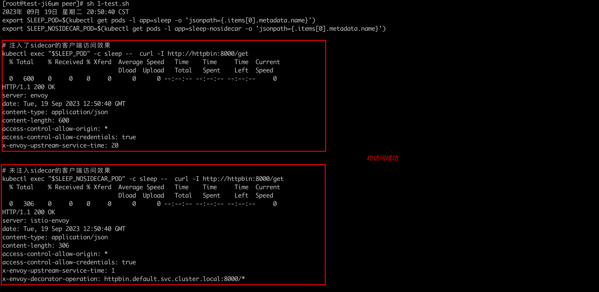
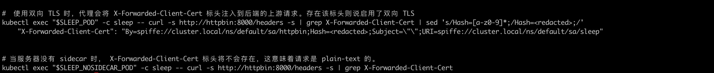
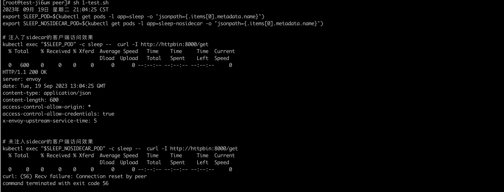

### 一: 服务之间mTLS

Istio 服务网格可以帮助云原生应用实现自动mtls，完成网格内的流量加密。有助于缩小云原生部署的攻击面。是构建零信任应用网络的关键框架

 


### 二: 部署客户端/服务端

1. 部署服务端httpbin

   ```yaml
   apiVersion: v1
   kind: ServiceAccount
   metadata:
     name: httpbin
   ---
   apiVersion: v1
   kind: Service
   metadata:
     name: httpbin
     labels:
       app: httpbin
       service: httpbin
   spec:
     ports:
     - name: http
       port: 8000
       targetPort: 80
     selector:
       app: httpbin
   ---
   apiVersion: apps/v1
   kind: Deployment
   metadata:
     name: httpbin
   spec:
     replicas: 1
     selector:
       matchLabels:
         app: httpbin
         version: v1
     template:
       metadata:
         labels:
           app: httpbin
           version: v1
       spec:
         serviceAccountName: httpbin
         containers:
         - image: docker.io/kong/httpbin
           imagePullPolicy: IfNotPresent
           name: httpbin
           ports:
           - containerPort: 80
   ```

   

2. 默认default ns下的pod均注入了sidecar

   手动部署一个负载，不注入sidecar

   ```yaml
   apiVersion: v1
   kind: ServiceAccount
   metadata:
     name: sleep
   ---
   apiVersion: v1
   kind: Service
   metadata:
     name: sleep
     labels:
       app: sleep
       service: sleep
   spec:
     ports:
     - port: 80
       name: http
     selector:
       app: sleep
   ---
   apiVersion: apps/v1
   kind: Deployment
   metadata:
     name: sleep
   spec:
     replicas: 1
     selector:
       matchLabels:
         app: sleep
     template:
       metadata:
         labels:
           app: sleep
       spec:
         terminationGracePeriodSeconds: 0
         serviceAccountName: sleep
         containers:
         - name: sleep
           image: curlimages/curl
           command: ["/bin/sleep", "infinity"]
           imagePullPolicy: IfNotPresent
           volumeMounts:
           - mountPath: /etc/sleep/tls
             name: secret-volume
         volumes:
         - name: secret-volume
           secret:
             secretName: sleep-secret
             optional: true
   
   
   ---
   apiVersion: v1
   kind: ServiceAccount
   metadata:
     name: sleep-nosidecar
   ---  
   # 不注入sidecar
   apiVersion: apps/v1
   kind: Deployment
   metadata:
     name: sleep-nosidecar
   spec:
     replicas: 1
     selector:
       matchLabels:
         app: sleep-nosidecar
     template:
       metadata:
         annotations:
           sidecar.istio.io/inject: 'false'
         labels:
           app: sleep-nosidecar
       spec:
         terminationGracePeriodSeconds: 0
         serviceAccountName: sleep-nosidecar
         containers:
         - name: sleep
           image: curlimages/curl
           command: ["/bin/sleep", "infinity"]
           imagePullPolicy: IfNotPresent
           volumeMounts:
           - mountPath: /etc/sleep/tls
             name: secret-volume
         volumes:
         - name: secret-volume
           secret:
             secretName: sleep-secret
             optional: true
   
   ```

   


2. 访问测试

   ```shell
   #! /bin/bash
   date
   set -v
   export SLEEP_POD=$(kubectl get pods -l app=sleep -o 'jsonpath={.items[0].metadata.name}')
   export SLEEP_NOSIDECAR_POD=$(kubectl get pods -l app=sleep-nosidecar -o 'jsonpath={.items[0].metadata.name}')
   
   # 注入了sidecar的客户端访问效果
   kubectl exec "$SLEEP_POD" -c sleep --  curl -quiet http://httpbin:8000/get
   
   # 未注入sidecar的客户端访问效果
   kubectl exec "$SLEEP_NOSIDECAR_POD" -c sleep -- curl -quiet http://httpbin:8000/get
   
   #使用双向 TLS 时，代理会将 X-Forwarded-Client-Cert 标头注入到后端的上游请求。存在该标头则说启用了双向 TLS。
   kubectl exec "$SLEEP_POD" -c sleep -- curl -s http://httpbin:8000/headers -s | grep X-Forwarded-Client-Cert 
   
   # 当服务器没有 sidecar 时， X-Forwarded-Client-Cert 标头将不会存在，这意味着请求是 plain-text 的。
   kubectl exec "$SLEEP_NOSIDECAR_POD" -c sleep -- curl -s http://httpbin:8000/headers -s | grep X-Forwarded-Client-Cert 
   
   
   
   ```

     

   


### 三：启动STRICT模式的mtls

- STRICT : 严格模式，典型模式，配置这种模式后，目标负载只接受双向mtls的流量

- PERMISSIVE : 宽容模式，网格默认模式，经常在网格迁移场景中。表示目标工作负载既可以接受双向TLS的双向流量，也可以接受普通的非加密流量

- DISABLE: 表示禁用双向TLS。不需要服务网格提供双向认证的场合

  

1. 启用STRICT模式

   ```yaml
   
   apiVersion: security.istio.io/v1beta1
   kind: PeerAuthentication
   metadata:
     name: httpbin-peer
   spec:
     mtls:
       mode: STRICT
     selector:
       matchLabels:
         app: httpbin
   
   ```

   

2. 访问测试

   注入了sidear的客户端 访问成功

   未注入sidecar的客户端 访问失败，退出码 56

   

    

