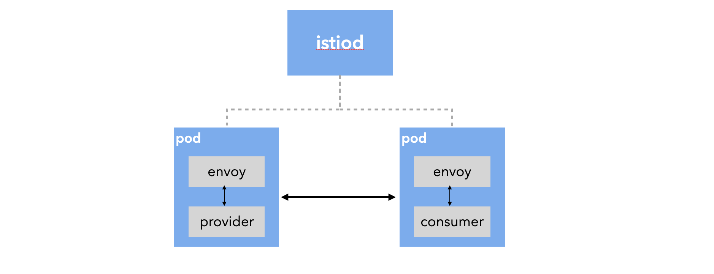
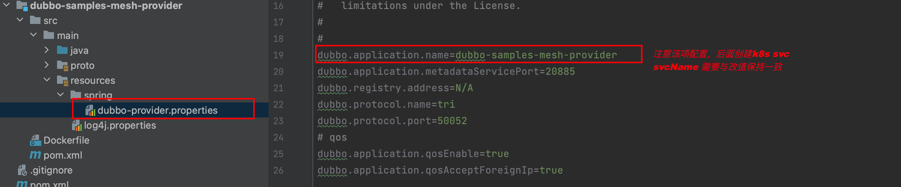
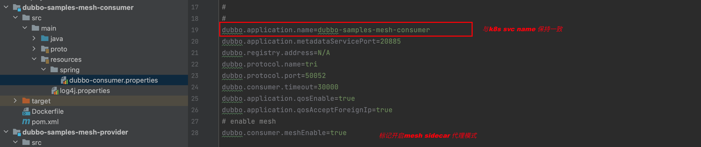
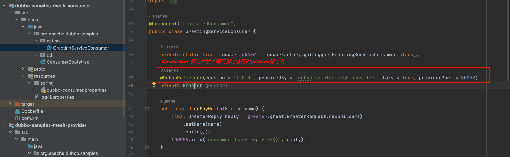
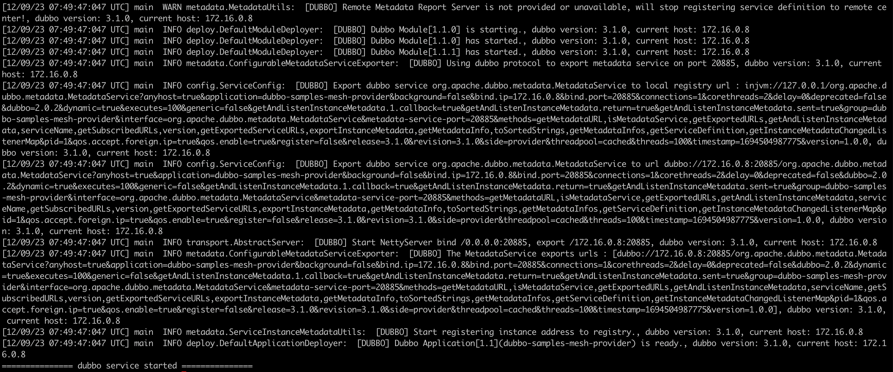
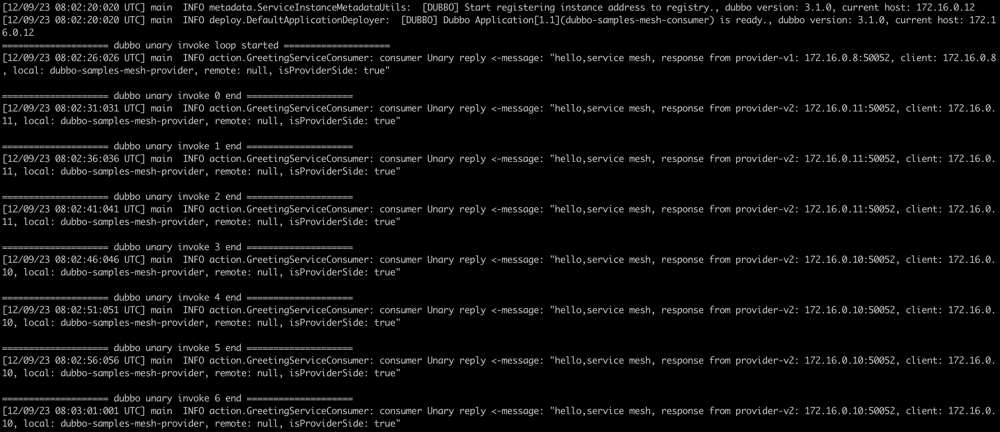
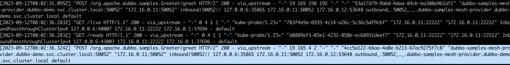
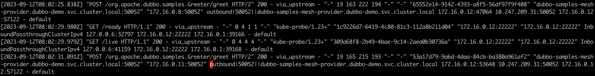
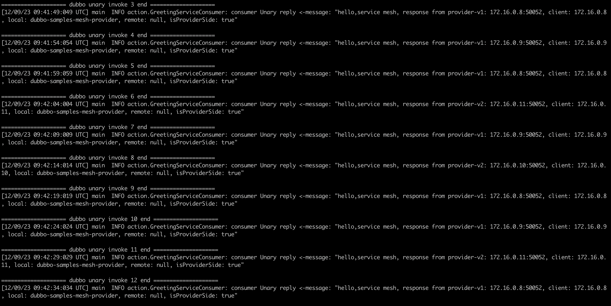

### 一:背景

- 部署dubbo3 应用到kubernetes

- istio 自动注入Envoy 实现流量拦截

- 基于istio 规则进行流量治理

  

  

---

### 二:准备环境

1. 部署k8s 环境
2. 部署istio环境
3. 制作业务镜像

 

---

### 三: dubbo3代码改造

1. 修改dubbo.properties

   需要注意dubbo.application.name的值和该服务对应的k8s svcname 保持一致

   

   

2. 业务代码注解修改

   需要在客户端进行显式调用，providerBy=“xxx”, xxx 为服务端的k8s svcname

   

---

### 三: 部署资源

1. 准备ns，并将ns设置sidecar自动注入

   ```yaml
   apiVersion: v1
   kind: Namespace
   metadata:
     name: dubbo-demo
     labels:
       istio-injection: enabled
   ```

    


2. 部署dubboprovider

   duboo 服务端正常启动

    

   查看日志可以发现注册信息:

      

   deployment-v1.yaml

   ```yaml
   apiVersion: apps/v1
   kind: Deployment
   metadata:
     name: dubbo-samples-mesh-provider-v1
     namespace: dubbo-demo
   spec:
     replicas: 2
     selector:
       matchLabels:
         app: dubbo-samples-mesh-provider
         version: v1
     template:
       metadata:
         labels:
           app: dubbo-samples-mesh-provider
           version: v1
         annotations:
           # Prevent istio rewrite http probe
           sidecar.istio.io/rewriteAppHTTPProbers: "false"
       spec:
         containers:
           - name: server
             image: apache/dubbo-demo:dubbo-samples-mesh-provider-v1_0.0.1
             imagePullPolicy: Always
             ports:
               - name: grpc-tri
                 containerPort: 50052
                 protocol: TCP
               - name: http-health
                 containerPort: 22222
                 protocol: TCP
             livenessProbe:
               httpGet:
                 path: /live
                 port: http-health
               initialDelaySeconds: 10
               periodSeconds: 5
               timeoutSeconds: 1
             readinessProbe:
               httpGet:
                 path: /ready
                 port: http-health
               initialDelaySeconds: 5
               periodSeconds: 5
               timeoutSeconds: 2
             startupProbe:
               httpGet:
                 path: /startup
                 port: http-health
               failureThreshold: 30
               initialDelaySeconds: 10
               periodSeconds: 5
               timeoutSeconds: 2
   
   ```

   Deployment-v2.yaml 如下：

   ```yaml
   apiVersion: apps/v1
   kind: Deployment
   metadata:
     name: dubbo-samples-mesh-provider-v2
     namespace: dubbo-demo
   spec:
     replicas: 2
     selector:
       matchLabels:
         app: dubbo-samples-mesh-provider
         version: v2
     template:
       metadata:
         labels:
           app: dubbo-samples-mesh-provider
           version: v2
         annotations:
           # Prevent istio rewrite http probe
           sidecar.istio.io/rewriteAppHTTPProbers: "false"
       spec:
         containers:
           - name: server
             image: apache/dubbo-demo:dubbo-samples-mesh-provider-v2_0.0.1
             imagePullPolicy: Always
             ports:
               - name: grpc-tri
                 containerPort: 50052
                 protocol: TCP
               - name: http-health
                 containerPort: 22222
                 protocol: TCP
             livenessProbe:
               httpGet:
                 path: /live
                 port: http-health
               initialDelaySeconds: 10
               periodSeconds: 5
               timeoutSeconds: 1
             readinessProbe:
               httpGet:
                 path: /ready
                 port: http-health
               initialDelaySeconds: 5
               periodSeconds: 5
               timeoutSeconds: 2
             startupProbe:
               httpGet:
                 path: /startup
                 port: http-health
               failureThreshold: 30
               initialDelaySeconds: 10
               periodSeconds: 5
               timeoutSeconds: 2
   ```

   service.yaml,需要注意portname以grpc开头，istio需要根据此name来识别治理的协议

   ```yaml
   apiVersion: v1
   kind: Service
   metadata:
     name: dubbo-samples-mesh-provider
     namespace: dubbo-demo
   spec:
     type: ClusterIP
     sessionAffinity: None
     selector:
       app: dubbo-samples-mesh-provider
     ports:
       - name: grpc-tri
         port: 50052
         targetPort: 50052
   ```

   

3. 部署consumer

   

   查看consumer日志信息:(Triple 协议被Envoy代理负载均衡)

    

   ---

   deployment.yaml：

   ```yaml
   apiVersion: apps/v1
   kind: Deployment
   metadata:
     name: dubbo-samples-mesh-consumer
     namespace: dubbo-demo
   spec:
     replicas: 1
     selector:
       matchLabels:
         app: dubbo-samples-mesh-consumer
         version: v1
     template:
       metadata:
         labels:
           app: dubbo-samples-mesh-consumer
           version: v1
         annotations:
           # Prevent istio rewrite http probe
           sidecar.istio.io/rewriteAppHTTPProbers: "false"
       spec:
         containers:
           - name: server
             image: apache/dubbo-demo:dubbo-samples-mesh-consumer_0.0.1
             imagePullPolicy: Always
             ports:
               - name: grpc-tri
                 containerPort: 50052
                 protocol: TCP
               - name: http-health
                 containerPort: 22222
                 protocol: TCP
             env:
               - name: POD_NAMESPACE
                 valueFrom:
                   fieldRef:
                     fieldPath: metadata.namespace
               # This environment variable does not need to be configured by default. When the domain name suffix used inside k8s is artificially changed, it is only necessary to configure this
               #- name: CLUSTER_DOMAIN
               #  value: cluster.local
             livenessProbe:
               httpGet:
                 path: /live
                 port: http-health
               initialDelaySeconds: 5
               periodSeconds: 5
             readinessProbe:
               httpGet:
                 path: /ready
                 port: http-health
               initialDelaySeconds: 5
               periodSeconds: 5
             startupProbe:
               httpGet:
                 path: /startup
                 port: http-health
               failureThreshold: 30
               initialDelaySeconds: 5
               periodSeconds: 5
               timeoutSeconds: 2
   
   ```

   Consumer-svc.yaml

   ```yaml
   apiVersion: v1
   kind: Service
   metadata:
     name: dubbo-samples-mesh-consumer
     namespace: dubbo-demo
   spec:
     type: ClusterIP
     sessionAffinity: None
     selector:
       app: dubbo-samples-mesh-consumer
     ports:
       - name: grpc-dubbo
         protocol: TCP
         port: 50052
         targetPort: 50052
   ```

   

---

### 四: 流量治理

1. 查看provider的envoy日志

   `kubectl logs -f -n dubbo-demo dubbo-samples-mesh-provider-v1-759fd9c4c8-c4l42 -c istio-proxy`

   可以看到sidec的inbound日志

    

   

   查看consumer的envoy日志:

   consumer istio-proxy的日志，outboub信息如下:

    


2. 创建流量治理规则(灰度发布 按比例)

    

   ```yaml
   apiVersion: networking.istio.io/v1alpha3
   kind: VirtualService
   metadata:
     name: dubbo-samples-mesh-provider
     namespace: dubbo-demo
   spec:
     hosts:
       - dubbo-samples-mesh-provider.dubbo-demo.svc.cluster.local
     http:
       - route:
           - destination:
               host: dubbo-samples-mesh-provider.dubbo-demo.svc.cluster.local
               subset: v1
               port:
                 number: 50052
             weight: 80
           - destination:
               host: dubbo-samples-mesh-provider.dubbo-demo.svc.cluster.local
               subset: v2
               port:
                 number: 50052
             weight: 20
   
   ---
   apiVersion: networking.istio.io/v1alpha3
   kind: DestinationRule
   metadata:
     name: dubbo-samples-mesh-provider
     namespace: dubbo-demo
   spec:
     host: dubbo-samples-mesh-provider.dubbo-demo.svc.cluster.local
     trafficPolicy:
       loadBalancer:
         simple: ROUND_ROBIN
     subsets:
       - name: v1
         labels:
           version: v1
       - name: v2
         labels:
           version: v2
   ```

   

3. 查看消费者日志发现流量比例趋势为8:2 符合规则

    


---

### 五: 参考资料

1. https://cn.dubbo.apache.org/zh-cn/overview/tasks/mesh/dubbo-mesh/