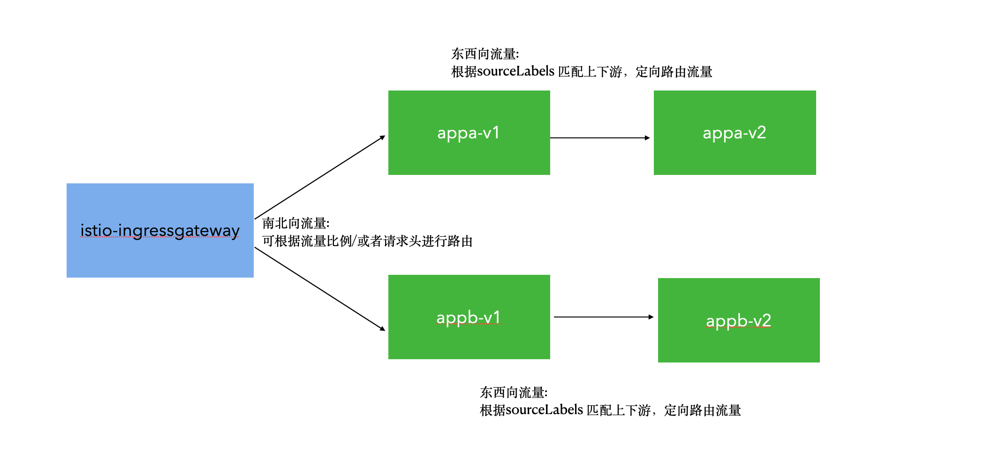
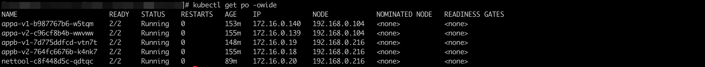
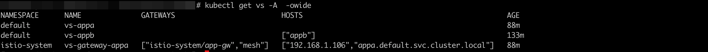
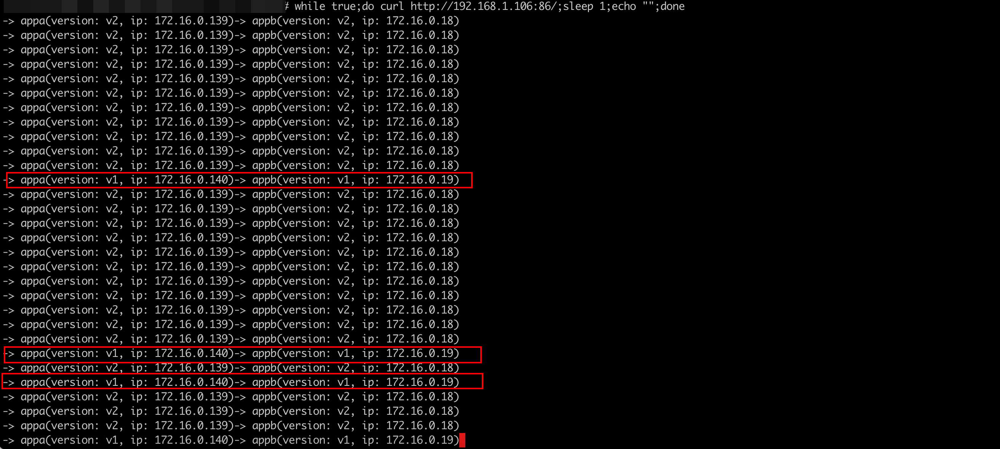
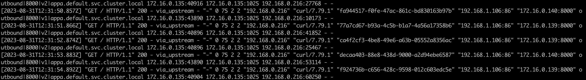
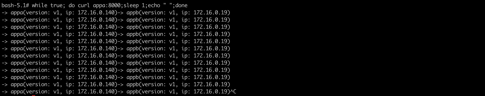
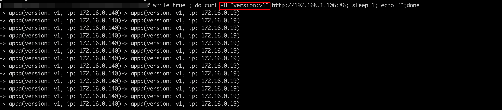
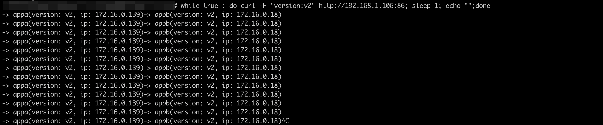
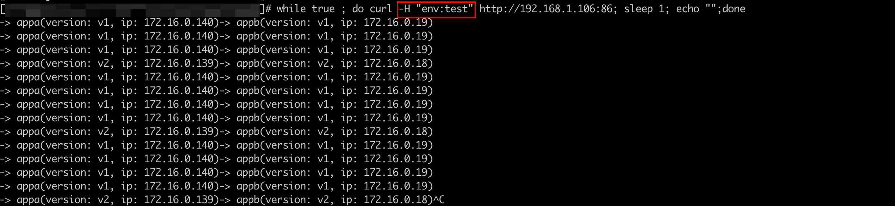
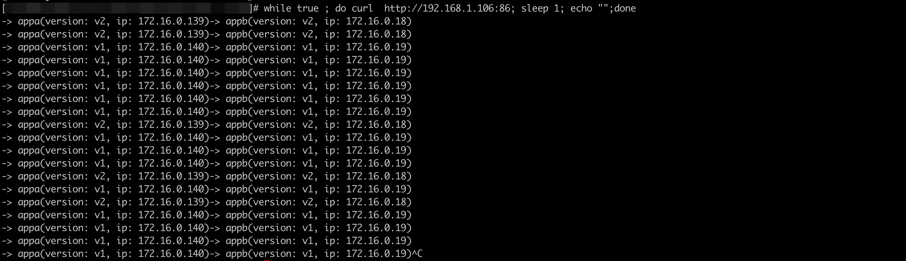

### 一: 全链路灰度发布

流量模型如下:



背景:

当前集群中，多个微服务，每个微服务都有多个版本，流量传递只会发生在同版本的服务之间，例如appa-v1 ==> appb-v1 ==>appc-v1 / appa-v2 ==> appb-v2 ==>appc-v2。

解决了多个服务同时发布灰度版本的问题


---

### 二: 部署应用

v1版本服务: v1.yaml

```yaml
apiVersion: v1
kind: Service
metadata:
  name: appa
  labels:
    app: appa
    service: appa
spec:
  ports:
  - port: 8000
    name: http
  selector:
    app: appa
---
apiVersion: apps/v1
kind: Deployment
metadata:
  name: appa-v1
  labels:
    app: appa
    version: v1
spec:
  replicas: 1
  selector:
    matchLabels:
      app: appa
      version: v1
  template:
    metadata:
      labels:
        app: appa
        version: v1
    spec:
      imagePullSecrets:
        - name: default-secret
      containers:
      - name: default
        image: swr.cn-north-4.myhuaweicloud.com/hjmtest/go-http-sample:1.0
        imagePullPolicy: IfNotPresent
        env:
        - name: version
          value: v1
        - name: app
          value: appa
        - name: upstream_url
          value: "http://appb:8000/"
        ports:
        - containerPort: 8000
---
apiVersion: v1
kind: Service
metadata:
  name: appb
  labels:
    app: appb
    service: appb
spec:
  ports:
  - port: 8000
    name: http
  selector:
    app: appb
---
apiVersion: apps/v1
kind: Deployment
metadata:
  name: appb-v1
  labels:
    app: appb
    version: v1
spec:
  replicas: 1
  selector:
    matchLabels:
      app: appb
      version: v1
  template:
    metadata:
      labels:
        app: appb
        version: v1
    spec:
      imagePullSecrets:
        - name: default-secret
      containers:
      - name: default
        image: swr.cn-north-4.myhuaweicloud.com/hjmtest/go-http-sample:1.0
        imagePullPolicy: IfNotPresent
        env:
        - name: version
          value: v1
        - name: app
          value: appb
        ports:
        - containerPort: 8000
                
```


v2版本服务: v2.yaml

```yaml
apiVersion: v1
kind: Service
metadata:
  name: appa
  labels:
    app: appa
    service: appa
spec:
  ports:
  - port: 8000
    name: http
  selector:
    app: appa
---
apiVersion: apps/v1
kind: Deployment
metadata:
  name: appa-v2
  labels:
    app: appa
    version: v2
spec:
  replicas: 1
  selector:
    matchLabels:
      app: appa
      version: v2
  template:
    metadata:
      labels:
        app: appa
        version: v2
    spec:
      imagePullSecrets:
        - name: default-secret
      containers:
      - name: default
        image: swr.cn-north-4.myhuaweicloud.com/hjmtest/go-http-sample:1.0
        imagePullPolicy: IfNotPresent
        env:
        - name: version
          value: v2
        - name: app
          value: appa
        - name: upstream_url
          value: "http://appb:8000/"
        ports:
        - containerPort: 8000
---
apiVersion: v1
kind: Service
metadata:
  name: appb
  labels:
    app: appb
    service: appb
spec:
  ports:
  - port: 8000
    name: http
  selector:
    app: appb
---
apiVersion: apps/v1
kind: Deployment
metadata:
  name: appb-v2
  labels:
    app: appb
    version: v2
spec:
  replicas: 1
  selector:
    matchLabels:
      app: appb
      version: v2
  template:
    metadata:
      labels:
        app: appb
        version: v2
    spec:
      imagePullSecrets:
        - name: default-secret
      containers:
      - name: default
        image: swr.cn-north-4.myhuaweicloud.com/hjmtest/go-http-sample:1.0
        imagePullPolicy: IfNotPresent
        env:
        - name: version
          value: v2
        - name: app
          value: appb
        ports:
        - containerPort: 8000          
```


部署完成后: 查看pod状态,pod 已就绪，并注入sidecar



查看service:


---

### 三: 添加路由策略

routing.yaml

```yaml
apiVersion: networking.istio.io/v1beta1
kind: DestinationRule
metadata:
  name: dr-appa
spec:
  host: appa
  trafficPolicy:
    loadBalancer:
      simple: ROUND_ROBIN
  subsets:
    - labels:
        version: v1
      name: v1
    - labels:
        version: v2
      name: v2
---
apiVersion: networking.istio.io/v1beta1
kind: DestinationRule
metadata:
  name: dr-appb
spec:
  host: appb
  trafficPolicy:
    loadBalancer:
      simple: ROUND_ROBIN
  subsets:
    - labels:
        version: v1
      name: v1
    - labels:
        version: v2
      name: v2
---
apiVersion: networking.istio.io/v1beta1
kind: VirtualService
metadata:
  name: vs-gateway-appa
  namespace: istio-system 
spec:
  gateways:
  - istio-system/app-gw
  - mesh
  hosts:
    - 192.168.1.106
    - appa.default.svc.cluster.local
  http:
  - delegate:
      name: vs-appa
      namespace: default
    match:
      - uri:
          prefix: /
          
---
apiVersion: networking.istio.io/v1beta1
kind: VirtualService
metadata:
  name: vs-appa
spec:

  http:
  - match:
      - gateways:
        - istio-system/app-gw
    route:
      - destination:
          host: appa
          subset: v1
        weight: 10
      - destination:
          host: appa
          subset: v2
        weight: 90
  - match:
      - gateways:
        - mesh
    route: 
      - destination:
          host: appa
          subset: v1
        weight: 100
      - destination:
          host: appa
          subset: v2
        weight: 0


---
apiVersion: networking.istio.io/v1beta1
kind: VirtualService
metadata:
  name: vs-appb
spec:
  hosts:
    - appb
  http:
    - route:
        - destination:
            host: appb
            subset: v1
      match:
        - sourceLabels:
            app: appa
            version: v1
    - route:
        - destination:
            host: appb
            subset: v2
      match:
        - sourceLabels:
            app: appa
            version: v2
            
     - route:
         - destination: 
           host: appb
           subset: v1
```

上述路由规则表示:

针对appa 服务:

​	从网关过来的流量，会根据比例路由到appa服务，其中appa-v1会接受10%左右的流量，appa-v2会接受90%左右的流量。网格内部的流量，会全部路由到appa-v1上

针对appb服务:

   该服务，不对外暴露，仅在集群内部使用。appb-v1只接受 下游标签是appa-v1的流量，appb-v2 只接受下游标签是appa-v2的服务。 


---

### 四: 访问测试



1. 访问网关服务，进入集群内部

   `while true;do curl http://192.168.1.106:86/;sleep 1;echo "";done`

   可以发现，入口服务 appa，根据流量比例进行分流: appa-v1 : appa-v2 = 1 : 9

   二级服务appb,则保持和入口服务一致的版本。

   

   查看istio-ingressgateway的日志:

   

    

2. 如果直接访问appa服务 

   可以看到，只会路由到各服务的v1版本，因为上述路由规则 有配置，集群内流量访问appa，会全部路由到appa的v1版本

   


---

### 五: 基于请求头的路由规则

修改routing.yaml,将入口服务appa的vs进行修改，例如: header携带version:v1,则路由到 appa的v1版本， header携带version:v2,则路由到 appa的v2版本

```yaml

apiVersion: networking.istio.io/v1beta1
kind: VirtualService
metadata:
  name: vs-appa
spec:

  http:
  - match:
      - gateways:
        - istio-system/app-gw
        headers:
          version:
            regex: v1
    route:
      - destination:
          host: appa
          subset: v1
  - match:
      - gateways:
        - istio-system/app-gw
        headers:
          version:
            regex: v2
    route: 
      - destination: 
          host: appa
          subset: v2
  - match:
      - gateways:
        - mesh
        - istio-system/app-gw
    route: 
      - destination:
          host: appa
          subset: v1
        weight: 80
      - destination:
          host: appa
          subset: v2
        weight: 20
  - route:
      - destination:
          host: appa
          subset: v1
```

该配置表示: 

从网关过来的流量:

​	基于请求头进行路由，header携带version:v1,则路由到 appa的v1版本， header携带version:v2,则路由到 appa的v2版本。其余的流量均会按比例路由到appa的v1和v2版本

网格内部的流量:

​	基于流量比例进行路由: appa-v1 : appa-v2 = 8:2


携带请求头version:v1 进行访问:

流量全打在v1版本上

 

携带请求头version:v2 进行访问:

流量全打在了v2版本上




不携带请求头，或者携带其他请求头: v1: v2 = 8:2



 