### 一: 改造重点

使用工具修改后，服务端可以直接用。客户端仍有部分代码需要手动修改完成适配

1. 接口处理

   使用工具处理后，部分代码还需手动处理，如接口类代码

   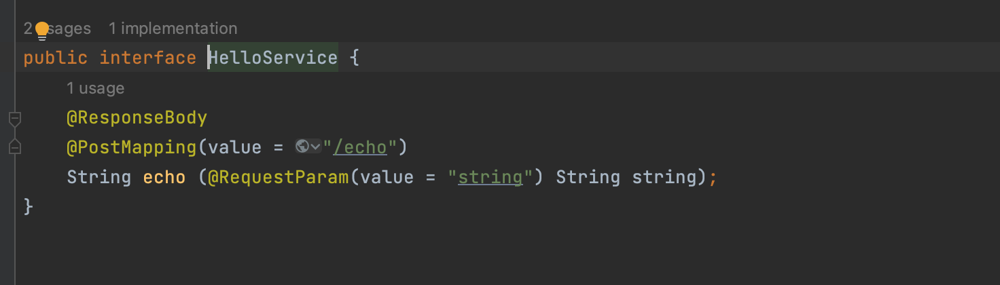 

2. 修改客户端调用服务端代码

   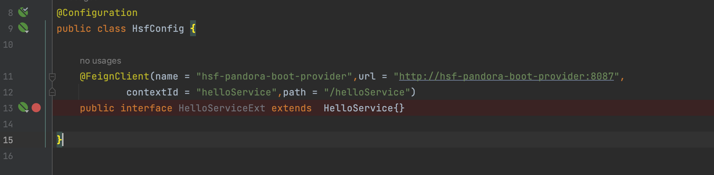 

   添加springcloud的feignclient调用配置 

     

---

### 二: 改造环境

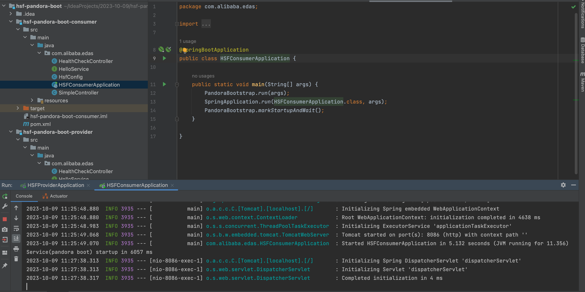 

1. hsf项目正常运行

   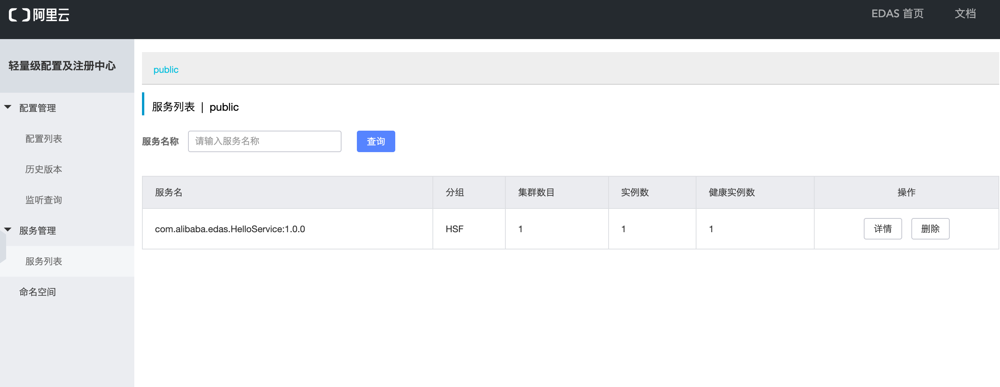 

   服务端正常注册在edas上

     

2. 访问客户端

   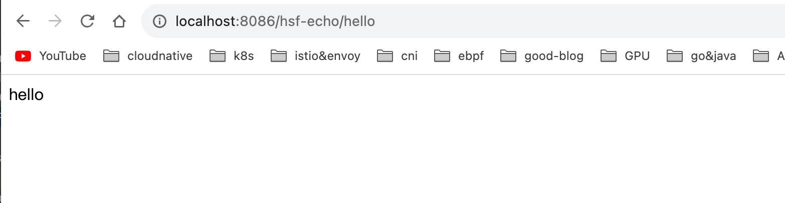 

   hsf项目改造前运行正常

---

### 三: 改造过程

将HSF 迁移SpringCloud 需要解决如下几个问题

- 将RPC接口定义修改为REST接口
- 将RPC接口调用修改为Feign接口调用
- 修改依赖关系和配置文件
- 其他常见问题修改，包括启动类修改，解决第三方软件冲突

---

对于大多数项目，可以通过migrator一键式完成修改。实际项目中，可能还会存在一些其他问题，需要手动处理，不能完全依赖工具来实现。

参考: https://github.com/huaweicse/migrator/wiki/hsf-2-cse

1. 下载migrator项目

   执行 `mvn clean install`

   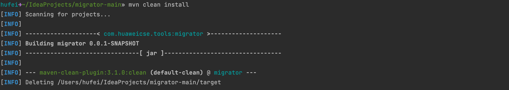 

   会在target目录编译出 migrator-0.0.1-SNAPSHOT.jar

   

2. 利用工具修改hsf项目

   将 migrator-0.0.1-SNAPSHOT.jar和templates目录拷贝到其他目录，然后运行

   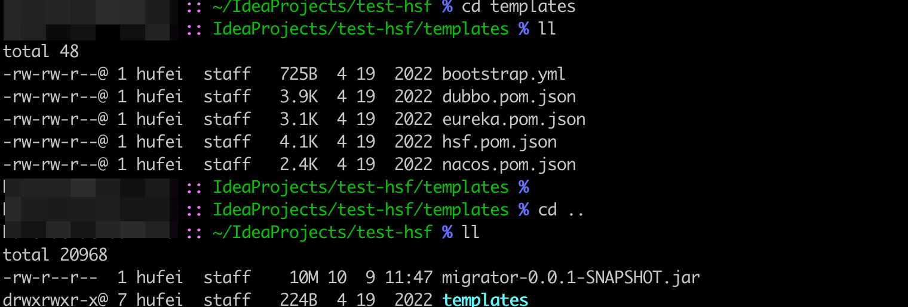 

   `java -jar migrator-0.0.1-SNAPSHOT.jar ModifyHSFAction [PROJECT_HOME] `

   其中PROJECT_HOME 是需要改造的项目根目录。

   工具修改的地方有:

   -  服务端的RPC接口修改为REST接口

     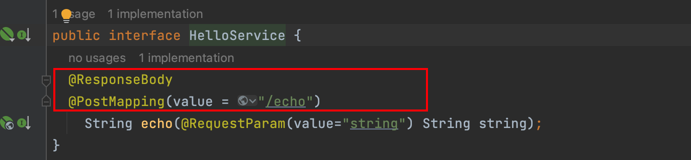 

   - 将实现类使用@RestController 发布接口

     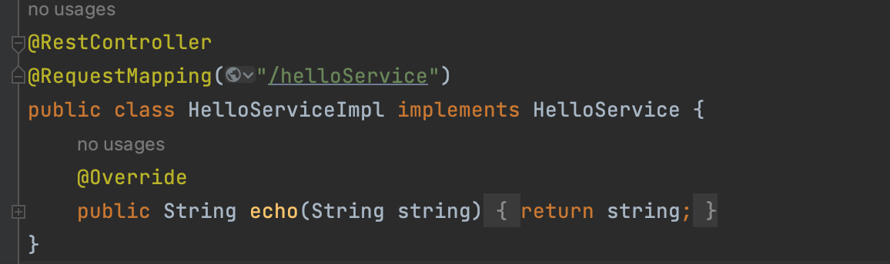 

   - 修改启动类，删除pandora 相关代码

     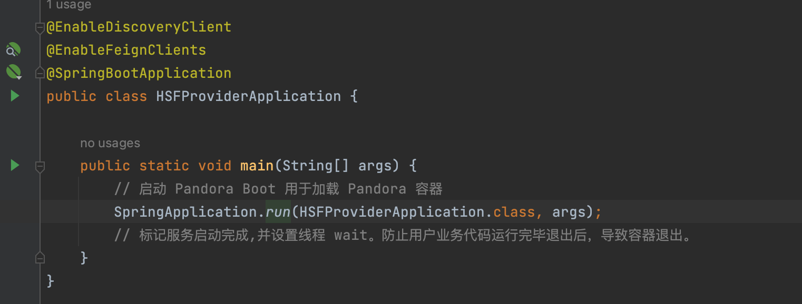  

     

   - 增加springcloud 配置文件

     springcloud 需要在bootstrap.yml中配置注册中心，配置中心等信息。

     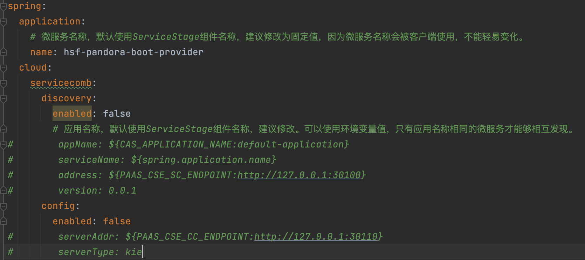 

     

     

   3. 服务端改造

   `java -jar migrator-0.0.1-SNAPSHOT.jar ModifyHSFAction ../2023-10-09/hsf-pandora-boot/hsf-pandora-boot-provider`

   程序运行完可以完成一键式修改，一些无法处理的情况，会打印日志。这种情况下需要手工处理。

   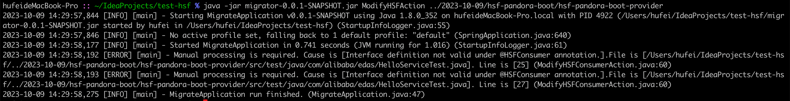

   查看报错的信息，均为测试类报错。测试类不影响业务。后续编译打包，测试类不参与。可忽略

   修改完成后，项目启动类会报错。退出项目然后重新打开即可。

   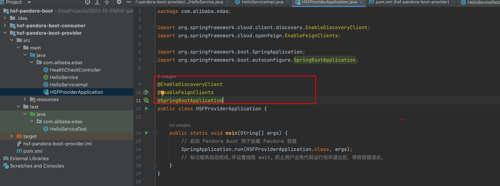  

   由于修改成springcloud 框架后，后续需要接入istio服务网格，服务注册中心依赖kubernetes。借用migrator工具，默认使用的服务发现平台是servicecomb。

   需要修改配置文件:

   application.properties:

   其中applicationName可放在bootstrap.yml中声明。为了方便和避免重复，只在application.properties 文件中设置服务端口即可

   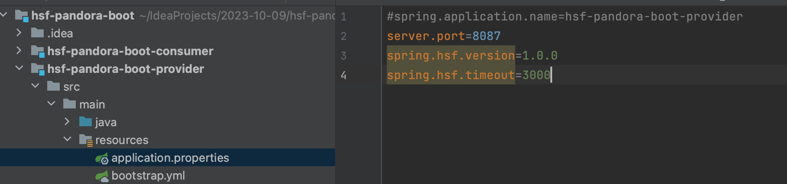  

   bootstrap.yml: 

   设置applicationName，同时将服务发现配置均设置为false

   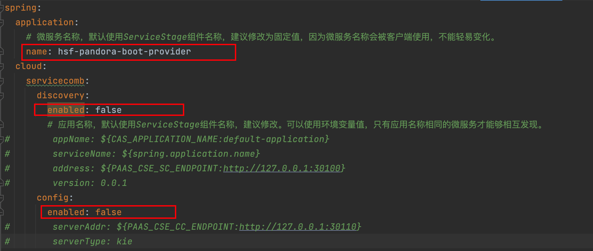 

   然后启动服务端:

   启动成功:

   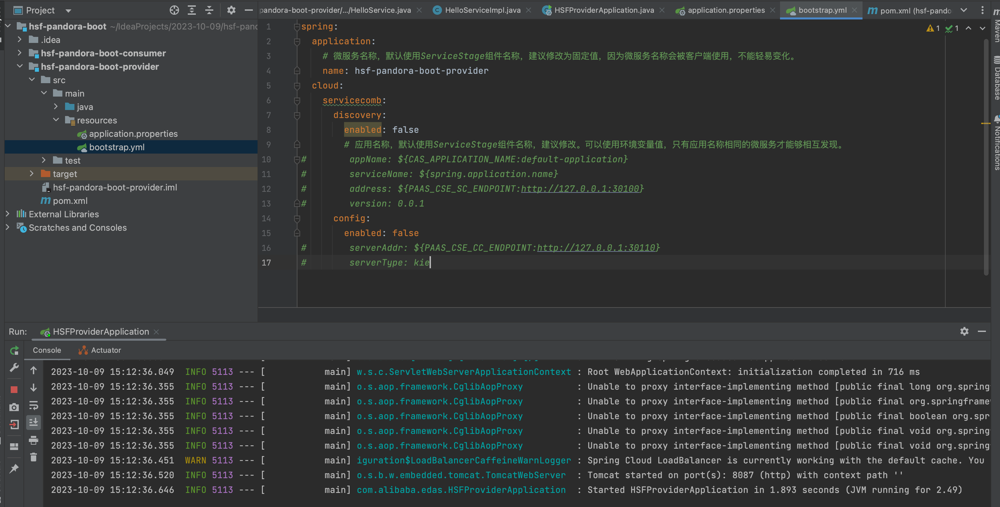 

   本地访问:

   访问成功

   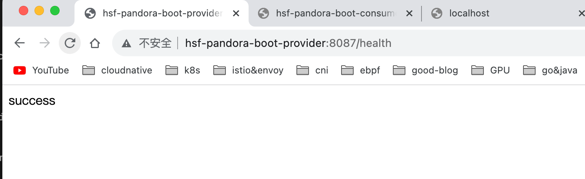 

4. 客户端改造

   `java -jar migrator-0.0.1-SNAPSHOT.jar ModifyHSFAction ../2023-10-09/hsf-pandora-boot/hsf-pandora-boot-consumer`

   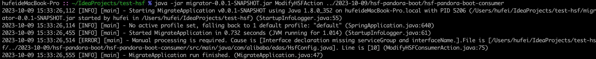

   日志显示有一条报错，其余配置转化成功。打开项目查看

    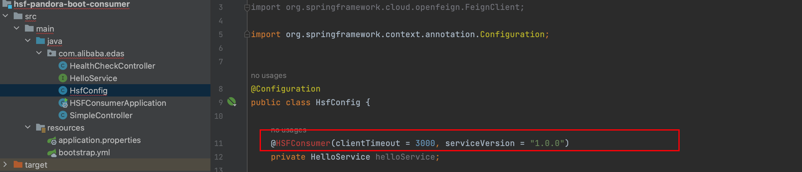  

   

   发现客户端的调用代码转换错误，此处需要手动处理了。

   删除HSF的引用定义，增加Feign的定义。Feign的定义需要增加服务名，根路径等信息。根路径和服务端的RequestMapping定义保持一致

   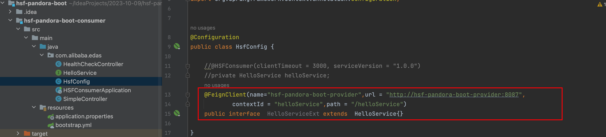 

   

   同时在客户端的接口定义中打上Rest标签

   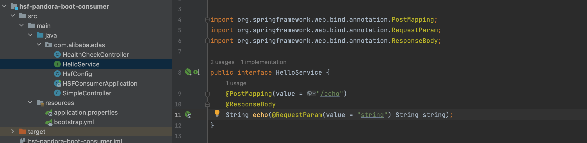  

   

   最后修改客户端的配置文件:

   修改逻辑和服务端一致，将配置中心 服务注册中心设置为false

   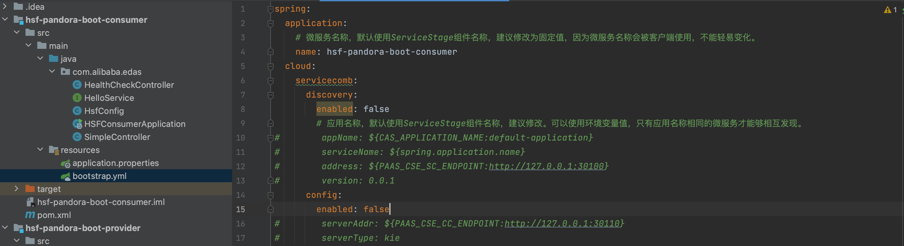  

   

     

5. 启动服务和端客户端进行联调测试

   均启动成功

   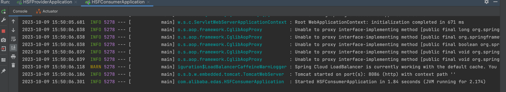 

   本地访问测试:

   访问成功

    