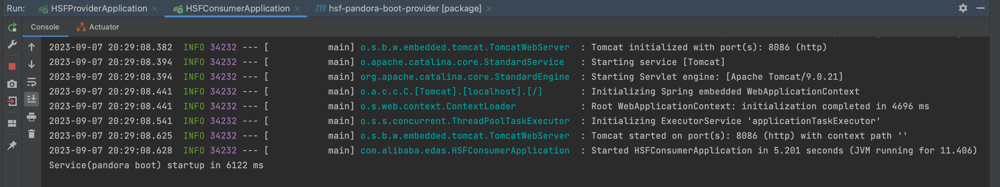

### 一： 背景

使用HSF框架开发的应用，服务注册和服务发现依赖了EDAS。现在准备接入istio实现服务治理

细节部分:

1. springboot脚手架
2. HSF负责服务发现，服务注册
3. EDAS 服务注册中心

如果要使用istio，最好的方式是借助k8s现成的service机制，来实现微服务的服务发现和注册

难点:

1. 如何废弃掉HSF中关于服务注册的配置？（可以在配置文件中将 `spring.hsf.enabled=true`）

2. 如果废弃掉服务注册，消费者则无法启动

3.  ...

   


---

### 二: 分解方案

搭建环境 ==》接入修改 ==〉编译打包/制作镜像 ==>容器化部署k8s ==> 接入istio

1. 由于之前没接触过HSF相关技术框架，要想知道运转流程，首先需要将环境搭建起来

2. 环境搭建起来后，进行配置修改（侵入式修改）

3. 编译成jar包，编写dockerfile制作镜像

4. 容器化部署

   

---

### 三: HSF应用搭建

使用HSF框架开发应用有Ali-Tomcat和Pandora Boot两种方式。

本次使用 Pandora Boot方式： 依赖Pandora，提供了比较完整的HSF功能，包括服务注册与发现、异步调用。应用程序编译为可运行的JAR包并部署即可。

项目参考: https://github.com/aliyun/alibabacloud-microservice-demo/tree/master/microservice-doc-demo/hsf-pandora-boot

 

1. 在开始开发应用前，需要启用配置中心/注册中心

   参考: https://help.aliyun.com/zh/edas/developer-reference/start-the-lightweight-configuration-center-1?spm=a2c4g.149507.0.i3#task-2310117

   部署完成完成后，访问ip+port 即可前往edas轻量级控制台

    

2. Maven中配置 EDAS 的私服地址

   编写edas-settings.xml文件

   ```xml
   <?xml version="1.0" encoding="UTF-8"?>
   
   <!--
   Licensed to the Apache Software Foundation (ASF) under one
   or more contributor license agreements.  See the NOTICE file
   distributed with this work for additional information
   regarding copyright ownership.  The ASF licenses this file
   to you under the Apache License, Version 2.0 (the
   "License"); you may not use this file except in compliance
   with the License.  You may obtain a copy of the License at
   
       http://www.apache.org/licenses/LICENSE-2.0
   
   Unless required by applicable law or agreed to in writing,
   software distributed under the License is distributed on an
   "AS IS" BASIS, WITHOUT WARRANTIES OR CONDITIONS OF ANY
   KIND, either express or implied.  See the License for the
   specific language governing permissions and limitations
   under the License.
   -->
   
   <!--
    | This is the configuration file for Maven. It can be specified at two levels:
    |
    |  1. User Level. This settings.xml file provides configuration for a single user,
    |                 and is normally provided in ${user.home}/.m2/settings.xml.
    |
    |                 NOTE: This location can be overridden with the CLI option:
    |
    |                 -s /path/to/user/settings.xml
    |
    |  2. Global Level. This settings.xml file provides configuration for all Maven
    |                 users on a machine (assuming they're all using the same Maven
    |                 installation). It's normally provided in
    |                 ${maven.conf}/settings.xml.
    |
    |                 NOTE: This location can be overridden with the CLI option:
    |
    |                 -gs /path/to/global/settings.xml
    |
    | The sections in this sample file are intended to give you a running start at
    | getting the most out of your Maven installation. Where appropriate, the default
    | values (values used when the setting is not specified) are provided.
    |
    |-->
   <settings xmlns="http://maven.apache.org/SETTINGS/1.2.0"
             xmlns:xsi="http://www.w3.org/2001/XMLSchema-instance"
             xsi:schemaLocation="http://maven.apache.org/SETTINGS/1.2.0 https://maven.apache.org/xsd/settings-1.2.0.xsd">
     <!-- localRepository
      | The path to the local repository maven will use to store artifacts.
      |
      | Default: ${user.home}/.m2/repository
     <localRepository>/path/to/local/repo</localRepository>
     -->
     <localRepository>/root/.m2/repository</localRepository>
   
     <!-- interactiveMode
      | This will determine whether maven prompts you when it needs input. If set to false,
      | maven will use a sensible default value, perhaps based on some other setting, for
      | the parameter in question.
      |
      | Default: true
     <interactiveMode>true</interactiveMode>
     -->
   
     <!-- offline
      | Determines whether maven should attempt to connect to the network when executing a build.
      | This will have an effect on artifact downloads, artifact deployment, and others.
      |
      | Default: false
     <offline>false</offline>
     -->
   
     <!-- pluginGroups
      | This is a list of additional group identifiers that will be searched when resolving plugins by their prefix, i.e.
      | when invoking a command line like "mvn prefix:goal". Maven will automatically add the group identifiers
      | "org.apache.maven.plugins" and "org.codehaus.mojo" if these are not already contained in the list.
      |-->
     <pluginGroups>
       <!-- pluginGroup
        | Specifies a further group identifier to use for plugin lookup.
       <pluginGroup>com.your.plugins</pluginGroup>
       -->
     </pluginGroups>
   
     <!-- proxies
      | This is a list of proxies which can be used on this machine to connect to the network.
      | Unless otherwise specified (by system property or command-line switch), the first proxy
      | specification in this list marked as active will be used.
      |-->
     <proxies>
       <!-- proxy
        | Specification for one proxy, to be used in connecting to the network.
        |
       <proxy>
         <id>optional</id>
         <active>true</active>
         <protocol>http</protocol>
         <username>proxyuser</username>
         <password>proxypass</password>
         <host>proxy.host.net</host>
         <port>80</port>
         <nonProxyHosts>local.net|some.host.com</nonProxyHosts>
       </proxy>
       -->
     </proxies>
   
     <!-- servers
      | This is a list of authentication profiles, keyed by the server-id used within the system.
      | Authentication profiles can be used whenever maven must make a connection to a remote server.
      |-->
     <servers>
       <!-- server
        | Specifies the authentication information to use when connecting to a particular server, identified by
        | a unique name within the system (referred to by the 'id' attribute below).
        |
        | NOTE: You should either specify username/password OR privateKey/passphrase, since these pairings are
        |       used together.
        |
       <server>
         <id>deploymentRepo</id>
         <username>repouser</username>
         <password>repopwd</password>
       </server>
       -->
   
       <!-- Another sample, using keys to authenticate.
       <server>
         <id>siteServer</id>
         <privateKey>/path/to/private/key</privateKey>
         <passphrase>optional; leave empty if not used.</passphrase>
       </server>
       -->
     </servers>
   
     <!-- mirrors
      | This is a list of mirrors to be used in downloading artifacts from remote repositories.
      |
      | It works like this: a POM may declare a repository to use in resolving certain artifacts.
      | However, this repository may have problems with heavy traffic at times, so people have mirrored
      | it to several places.
      |
      | That repository definition will have a unique id, so we can create a mirror reference for that
      | repository, to be used as an alternate download site. The mirror site will be the preferred
      | server for that repository.
      |-->
     <mirrors>
     	<!-- 阿里云仓库 -->
     	<mirror>
     		<id>alimaven</id>
     		<mirrorOf>central</mirrorOf>
     		<name>aliyun maven</name>
     		<url>http://maven.aliyun.com/nexus/content/repositories/central/</url>
     	</mirror>
     
     	<mirror>
           <id>mirrorId</id>
           <mirrorOf>repositoryId</mirrorOf>
           <name>Human Readable Name for this Mirror.</name>
           <url>http://my.repository.com/repo/path</url>
         </mirror>
     </mirrors>
   
     <!-- profiles
      | This is a list of profiles which can be activated in a variety of ways, and which can modify
      | the build process. Profiles provided in the settings.xml are intended to provide local machine-
      | specific paths and repository locations which allow the build to work in the local environment.
      |
      | For example, if you have an integration testing plugin - like cactus - that needs to know where
      | your Tomcat instance is installed, you can provide a variable here such that the variable is
      | dereferenced during the build process to configure the cactus plugin.
      |
      | As noted above, profiles can be activated in a variety of ways. One way - the activeProfiles
      | section of this document (settings.xml) - will be discussed later. Another way essentially
      | relies on the detection of a system property, either matching a particular value for the property,
      | or merely testing its existence. Profiles can also be activated by JDK version prefix, where a
      | value of '1.4' might activate a profile when the build is executed on a JDK version of '1.4.2_07'.
      | Finally, the list of active profiles can be specified directly from the command line.
      |
      | NOTE: For profiles defined in the settings.xml, you are restricted to specifying only artifact
      |       repositories, plugin repositories, and free-form properties to be used as configuration
      |       variables for plugins in the POM.
      |
      |-->
      <profiles>
         <profile>
             <id>nexus</id>
             <repositories>
                 <repository>
                     <id>central</id>
                     <url>http://repo1.maven.org/maven2</url>
                     <releases>
                         <enabled>true</enabled>
                     </releases>
                     <snapshots>
                         <enabled>true</enabled>
                     </snapshots>
                 </repository>
             </repositories>
             <pluginRepositories>
                 <pluginRepository>
                     <id>central</id>
                     <url>http://repo1.maven.org/maven2</url>
                     <releases>
                         <enabled>true</enabled>
                     </releases>
                     <snapshots>
                         <enabled>true</enabled>
                     </snapshots>
                 </pluginRepository>
             </pluginRepositories>
         </profile>
         <profile>
             <id>edas.oss.repo</id>
             <repositories>
                 <repository>
                     <id>edas-oss-central</id>
                     <name>taobao mirror central</name>
                     <url>http://edas-public.oss-cn-hangzhou.aliyuncs.com/repository</url>
                     <snapshots>
                         <enabled>true</enabled>
                     </snapshots>
                     <releases>
                         <enabled>true</enabled>
                     </releases>
                 </repository>
                 </repositories>
             <pluginRepositories>
                 <pluginRepository>
                     <id>edas-oss-plugin-central</id>
                     <url>http://edas-public.oss-cn-hangzhou.aliyuncs.com/repository</url>
                     <snapshots>
                         <enabled>true</enabled>
                     </snapshots>
                     <releases>
                         <enabled>true</enabled>
                     </releases>
                 </pluginRepository>
             </pluginRepositories>
         </profile>
       </profiles>
       <activeProfiles>
           <activeProfile>nexus</activeProfile>
           <activeProfile>edas.oss.repo</activeProfile>
       </activeProfiles>
   
   </settings>
   
   ```

   然后使用ide打开项目，配置maven

     

   在命令行执行命令mvn help:effective-settings，验证配置是否成功。无报错，表明 setting.xml 文件格式没问题。

    


3. 配置环境准备好后，导入maven依赖，服务可以正常运行

   生产者运行成功:

   

   消费者运行成功:

    

4. 控制台进行访问

   

   访问成功

    

5. 查看注册中心

   生产者实例注册成功

   