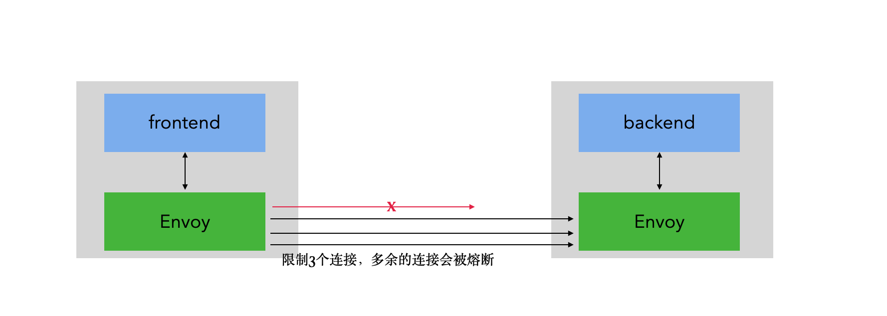
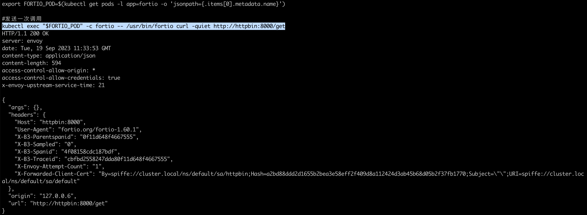
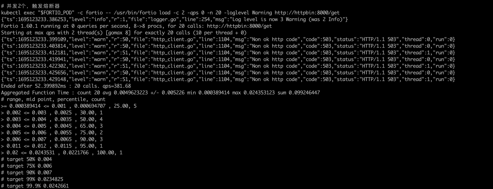
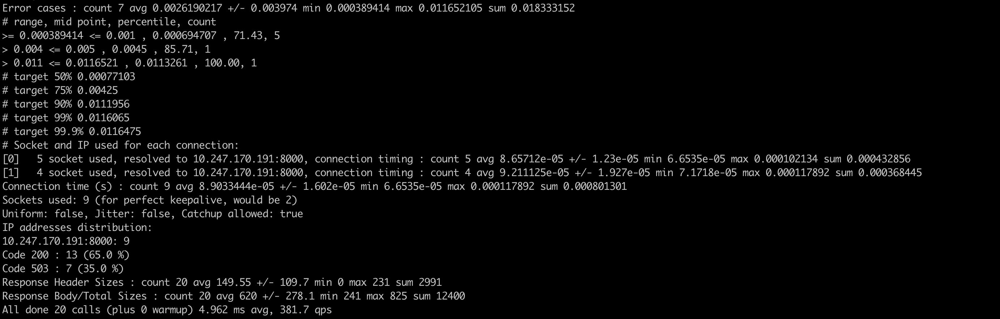
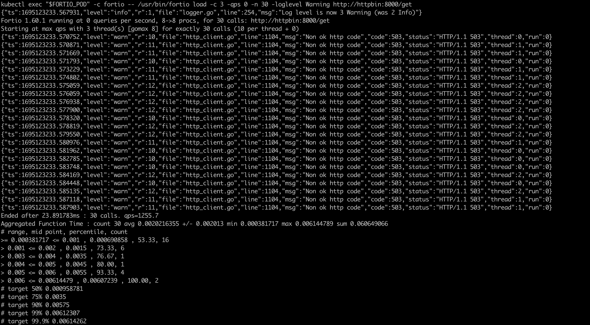
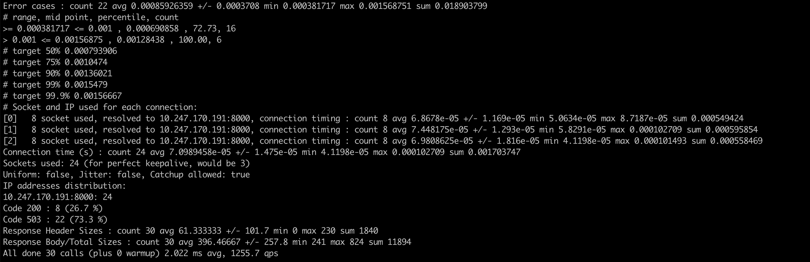
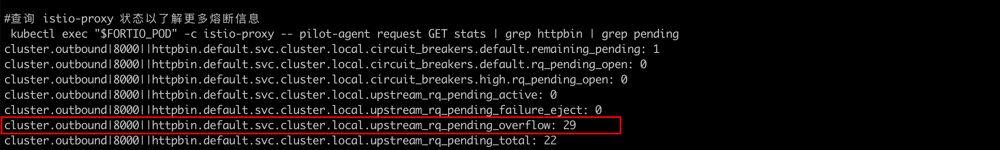

### 一: 连接池connectionPool

 

连接池的配置可以实现基于容量限制的熔断，超过设定阈值的请求直接丢弃返回错误。

 

### 二: 准备测试资源


1. 配置服务端 httpbin

   ```yaml
   apiVersion: v1
   kind: ServiceAccount
   metadata:
     name: httpbin
   ---
   apiVersion: v1
   kind: Service
   metadata:
     name: httpbin
     labels:
       app: httpbin
       service: httpbin
   spec:
     ports:
     - name: http
       port: 8000
       targetPort: 80
     selector:
       app: httpbin
   ---
   apiVersion: apps/v1
   kind: Deployment
   metadata:
     name: httpbin
   spec:
     replicas: 1
     selector:
       matchLabels:
         app: httpbin
         version: v1
     template:
       metadata:
         labels:
           app: httpbin
           version: v1
       spec:
         serviceAccountName: httpbin
         containers:
         - image: docker.io/kong/httpbin
           imagePullPolicy: IfNotPresent
           name: httpbin
           ports:
           - containerPort: 80
   ```

   


2. 配置客户端

   创建客户端程序以发送流量到 `httpbin` 服务。这是一个名为 [Fortio](https://github.com/istio/fortio) 的负载测试客户端，它可以控制连接数、并发数及发送 HTTP 请求的延迟。通过 Fortio 能够有效的触发前面在 `DestinationRule` 中设置的熔断策略。

   ```yaml
   apiVersion: v1
   kind: Service
   metadata:
     name: fortio
     labels:
       app: fortio
       service: fortio
   spec:
     ports:
     - port: 8080
       name: http
     selector:
       app: fortio
   ---
   apiVersion: apps/v1
   kind: Deployment
   metadata:
     name: fortio-deploy
   spec:
     replicas: 1
     selector:
       matchLabels:
         app: fortio
     template:
       metadata:
         annotations:
           # This annotation causes Envoy to serve cluster.outbound statistics via 15000/stats
           # in addition to the stats normally served by Istio. The Circuit Breaking example task
           # gives an example of inspecting Envoy stats via proxy config.
           proxy.istio.io/config: |-
             proxyStatsMatcher:
               inclusionPrefixes:
               - "cluster.outbound"
               - "cluster_manager"
               - "listener_manager"
               - "server"
               - "cluster.xds-grpc"
         labels:
           app: fortio
       spec:
         containers:
         - name: fortio
           image: fortio/fortio:latest_release
           imagePullPolicy: Always
           ports:
           - containerPort: 8080
             name: http-fortio
           - containerPort: 8079
             name: grpc-ping
   ```

   


### 三: 配置istio资源

熔断和连接池的配置均配置在destinationrule中

```yaml
apiVersion: networking.istio.io/v1alpha3
kind: DestinationRule
metadata:
  name: httpbin
spec:
  host: httpbin
  trafficPolicy:
    connectionPool:
      tcp:
        maxConnections: 1
      http:
        http1MaxPendingRequests: 1
        maxRequestsPerConnection: 1
    outlierDetection:
      consecutive5xxErrors: 1
      interval: 1s
      baseEjectionTime: 3m
      maxEjectionPercent: 100
```


### 四: 测试

1. 单次访问

   ```bash
   export FORTIO_POD=$(kubectl get pods -l app=fortio -o 'jsonpath={.items[0].metadata.name}')
   kubectl exec "$FORTIO_POD" -c fortio -- /usr/bin/fortio curl -quiet http://httpbin:8000/get
   ```

    

     

2. 并发2个，请求20次

   ```bash
   kubectl exec "$FORTIO_POD" -c fortio -- /usr/bin/fortio load -c 2 -qps 0 -n 20 -loglevel Warning http://httpbin:8000/get
   ```

    

    
   
   可以看到有7次请求触发熔断，istio-proxy允许少量误差存在
   
    

3. 将并发数提高的3个，请求30次

    

    

   现在，您将开始看到预期的熔断行为，只有 26.7% 的请求成功，其余的均被熔断器拦截：  

4. 查看过载数量

   可以看到 `upstream_rq_pending_overflow` 值 `29`，这意味着连接池过载，目前为止已有 29 个调用被标记为熔断。

    