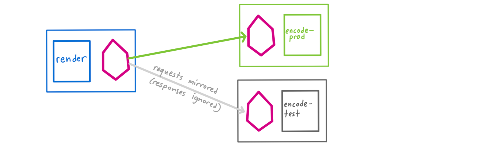
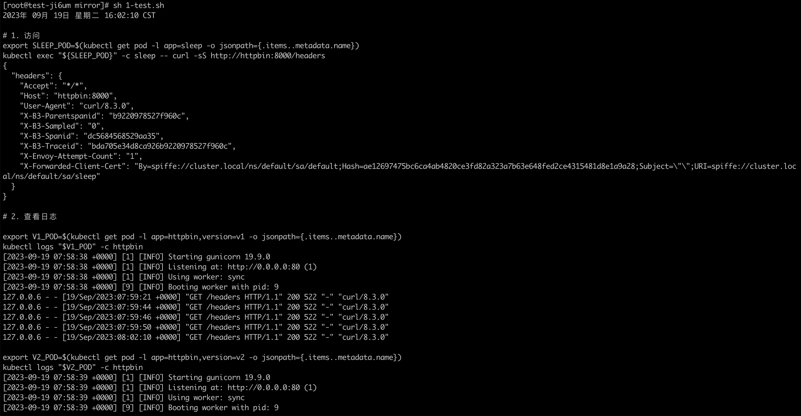
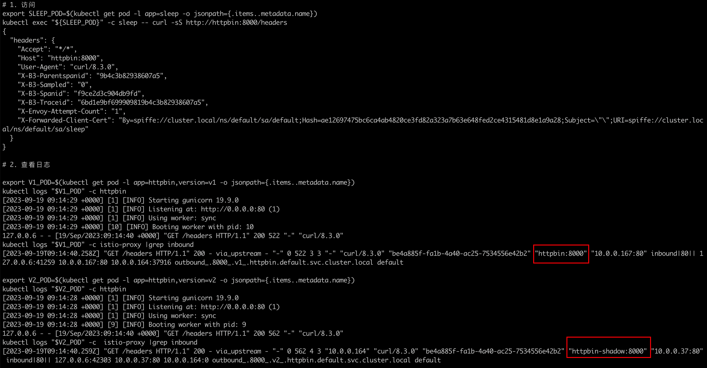

### 一: 流量镜像

流量镜像，也称为影子流量，是一个以尽可能低的风险为生产带来变化的强大的功能。 镜像会将实时流量的副本发送到镜像服务。镜像流量发生在主服务的关键请求路径之外。

  


### 二: 创建基本资源

首先部署两个版本的 [Httpbin](https://github.com/istio/istio/tree/release-1.19/samples/httpbin) 服务，并开启访问日志功能：

1. 创建v1版本

   ```yaml
   apiVersion: apps/v1
   kind: Deployment
   metadata:
     name: httpbin-v1
   spec:
     replicas: 1
     selector:
       matchLabels:
         app: httpbin
         version: v1
     template:
       metadata:
         labels:
           app: httpbin
           version: v1
       spec:
         containers:
         - image: docker.io/kennethreitz/httpbin
           imagePullPolicy: IfNotPresent
           name: httpbin
           command: ["gunicorn", "--access-logfile", "-", "-b", "0.0.0.0:80", "httpbin:app"]
           ports:
           - containerPort: 80
   ```

   

2. 创建v2版本

   ```yaml
   apiVersion: apps/v1
   kind: Deployment
   metadata:
     name: httpbin-v2
   spec:
     replicas: 1
     selector:
       matchLabels:
         app: httpbin
         version: v2
     template:
       metadata:
         labels:
           app: httpbin
           version: v2
       spec:
         containers:
         - image: docker.io/kennethreitz/httpbin
           imagePullPolicy: IfNotPresent
           name: httpbin
           command: ["gunicorn", "--access-logfile", "-", "-b", "0.0.0.0:80", "httpbin:app"]
           ports:
           - containerPort: 80
   
   ```

   

3. 创建service

   ```yaml
   apiVersion: v1
   kind: Service
   metadata:
     name: httpbin
     labels:
       app: httpbin
   spec:
     ports:
     - name: http
       port: 8000
       targetPort: 80
     selector:
       app: httpbin
   
   ```

   

4. 创建客户端负载

   ```yaml
   apiVersion: apps/v1
   kind: Deployment
   metadata:
     name: sleep
   spec:
     replicas: 1
     selector:
       matchLabels:
         app: sleep
     template:
       metadata:
         labels:
           app: sleep
       spec:
         containers:
         - name: sleep
           image: curlimages/curl
           command: ["/bin/sleep","3650d"]
           imagePullPolicy: IfNotPresent
   ```


### 三: 创建istio crd 管理流量

1. 创建vs进行流量管理

   默认没有使用影子流量

   ```yaml
   apiVersion: networking.istio.io/v1alpha3
   kind: VirtualService
   metadata:
     name: httpbin
   spec:
     hosts:
       - httpbin
     http:
     - route:
       - destination:
           host: httpbin
           subset: v1
         weight: 100
   ---
   apiVersion: networking.istio.io/v1alpha3
   kind: DestinationRule
   metadata:
     name: httpbin
   spec:
     host: httpbin
     subsets:
     - name: v1
       labels:
         version: v1
     - name: v2
       labels:
         version: v2
   ```

   

2. 测试脚本

   ```shell
   #! /bin/bash
   date
   set -v
   
   # 1. 访问
   export SLEEP_POD=$(kubectl get pod -l app=sleep -o jsonpath={.items..metadata.name})
   kubectl exec "${SLEEP_POD}" -c sleep -- curl -sS http://httpbin:8000/headers
   
   # 2. 查看日志
   
   export V1_POD=$(kubectl get pod -l app=httpbin,version=v1 -o jsonpath={.items..metadata.name})
   kubectl logs "$V1_POD" -c httpbin
   
   export V2_POD=$(kubectl get pod -l app=httpbin,version=v2 -o jsonpath={.items..metadata.name})
   kubectl logs "$V2_POD" -c httpbin
   
   ```

   测试结果: 分别查看 `httpbin` Pod的 `v1` 和 `v2` 两个版本的日志。您可以看到 `v1` 版本的访问日志条目，而 `v2` 版本没有日志：

    

3. 配置镜像流量

   镜像到v2。

   ⚠️: 镜像流量的目标通过destination 结构描述，可以是httpbin服务的一个版本，或者是服务网格的另一个服务，也可以是通过seviceentry定义的服务网格外部的服务。

   ```yaml
   apiVersion: networking.istio.io/v1alpha3
   kind: VirtualService
   metadata:
     name: httpbin
   spec:
     hosts:
       - httpbin
     http:
     - route:
       - destination:
           host: httpbin
           subset: v1
         weight: 100
       mirror:
         host: httpbin
         subset: v2
       mirrorPercentage:
         value: 100.0
   
   ```

   这个路由规则发送 100% 流量到 `v1` 版本。最后一节表示您将 100% 的相同流量镜像（即发送）到 `httpbin:v2` 服务。 当流量被镜像时，请求将发送到镜像服务中，并在 `headers` 中的 `Host/Authority` 属性值上追加 `-shadow`。 例如 `cluster-1` 变为 `cluster-1-shadow`。

   

   ⚠️: 此外，重点注意这些被镜像的流量是『即发即弃』的，就是说镜像请求的响应会被丢弃。

   ⚠️: 可以使用 `mirrorPercentage` 属性下的 `value` 字段来设置镜像流量的百分比，而不是镜像所有请求。如果没有这个属性，将镜像所有流量。

   

4. 测试

   影子负载也接收到全量的流量

    

   现在就可以看到 `v1` 和 `v2` 版本中都有了访问日志。v2 版本中的访问日志就是由镜像流量产生的，这些请求的实际目标是 `v1` 版本。  